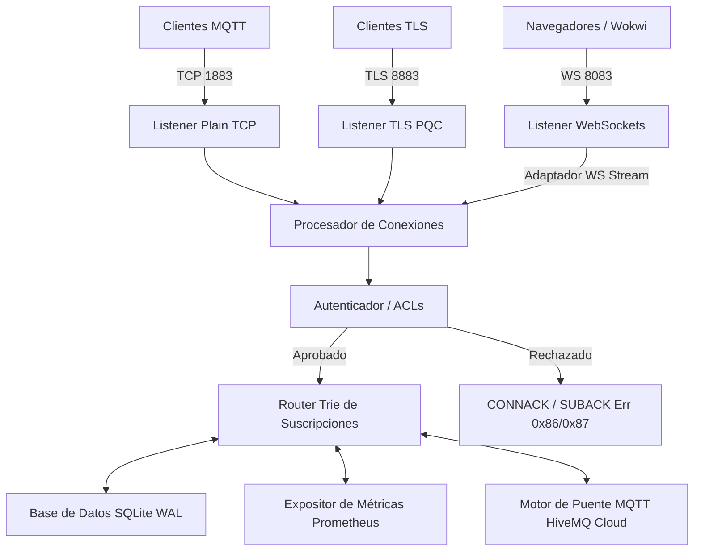

# <svg width="36" height="36" viewBox="0 0 24 24" fill="none" xmlns="http://www.w3.org/2000/svg" style="vertical-align: middle; margin-right: 8px;"><path d="M12 21C12 21 8.5 17.5 3 17.5C3 12.5 5 9 10 9C9 7.5 9.5 5.5 11 4.5C11.5 5.5 12 5.5 12 5.5C12 5.5 12.5 5.5 13 4.5C14.5 5.5 15 7.5 14 9C19 9 21 12.5 21 17.5C15.5 17.5 12 21 12 21Z" stroke="currentColor" stroke-width="2" stroke-linejoin="round"/></svg> Pipistrelle MQTT v5.0 Broker

¡Bienvenido a **Pipistrelle**, un broker MQTT v5.0 ultraligero y de alto rendimiento escrito en **Rust**! Diseñado específicamente para sistemas embebidos, computadoras de placa única (SBCs como Raspberry Pi u Orange Pi) y entornos de producción modernos. 

Pipistrelle ofrece capacidades de **Criptografía Post-Cuántica (PQC)** para TLS 1.3, persistencia tolerante a fallos basada en **SQLite WAL**, soporte nativo para **WebSockets**, métricas en formato **Prometheus** y un motor de **puente bidireccional** hacia la nube (como HiveMQ Cloud).

---

## <svg width="24" height="24" viewBox="0 0 24 24" fill="none" xmlns="http://www.w3.org/2000/svg" style="vertical-align: middle; margin-right: 8px;"><path d="M12 22C17.5228 22 22 17.5228 22 12C22 6.47715 17.5228 2 12 2C6.47715 2 2 6.47715 2 12C2 17.5228 6.47715 22 12 22Z" stroke="currentColor" stroke-width="2"/><path d="M12 6L9 11H15L12 6Z" fill="currentColor"/><path d="M12 11V16" stroke="currentColor" stroke-width="2"/></svg> Características Destacadas

*   **Arquitectura Zero-Copy & Concurrente:** El decodificador de paquetes (`src/codec.rs`) realiza cortes de memoria (*slices*) directamente del búfer de red utilizando tiempos de vida de Rust, minimizando las asignaciones de memoria y maximizando el rendimiento bajo alta concurrencia de clientes.
*   **Criptografía Post-Cuántica (PQC) TLS 1.3:** Integrado con `tokio-rustls` y el proveedor criptográfico `aws-lc-rs`, priorizando el algoritmo híbrido **`X25519MLKEM768`** para proteger tus comunicaciones IoT contra futuras amenazas de descifrado cuántico.
*   **Soporte Nativo de WebSockets (Puerto 8083):** Conexiones WebSocket MQTT integradas de forma transparente mediante un adaptador que implementa `AsyncRead` + `AsyncWrite`. Compatible con dashboards web y simuladores basados en navegador (como Wokwi).
*   **Persistencia Resistente a Pérdida de Energía (SQLite WAL):** Base de datos embebida SQLite con modo **WAL (Write-Ahead Logging)** habilitado por defecto. Ofrece una resiliencia extrema ante apagones repentinos en placas ARM y recupera automáticamente sesiones, suscripciones y mensajes QoS 1 en tránsito.
*   **Exportador de Métricas Prometheus (Puerto 9090):** Expone un endpoint HTTP `/metrics` listo para ser recolectado por instancias de Prometheus. Monitorea conexiones activas, mensajes publicados, suscripciones y rendimiento del broker en tiempo real.
*   **Puente Bidireccional Integrado:** Conectividad automática a brokers remotos (ej. **HiveMQ Cloud**) para reenviar tópicos locales (ej. `sensor/#`) hacia la nube y recibir comandos remotos (ej. `alerts/#`) localmente.
*   **Autenticación & ACLs Dinámicas:** Validación dinámica de usuarios a través de `credentials.json` mediante hash SHA-256 de alta velocidad y reglas de control de acceso granulares a nivel de lectura/escritura en tópicos.
*   **Generación Automática de Certificados:** Si los archivos `cert.pem` y `key.pem` no están en el volumen, Pipistrelle genera automáticamente certificados auto-firmados válidos para `localhost`, `127.0.0.1`, `10.0.1.2` y `host.wokwi.internal`.

---

## <svg width="24" height="24" viewBox="0 0 24 24" fill="none" xmlns="http://www.w3.org/2000/svg" style="vertical-align: middle; margin-right: 8px;"><rect x="3" y="3" width="7" height="7" rx="1.5" stroke="currentColor" stroke-width="2"/><rect x="14" y="3" width="7" height="7" rx="1.5" stroke="currentColor" stroke-width="2"/><rect x="8.5" y="14" width="7" height="7" rx="1.5" stroke="currentColor" stroke-width="2"/><path d="M6.5 10V12H8.5" stroke="currentColor" stroke-width="2" stroke-linecap="round"/><path d="M17.5 10V12H15.5" stroke="currentColor" stroke-width="2" stroke-linecap="round"/></svg> Arquitectura del Sistema

El broker está estructurado de manera modular para garantizar legibilidad y escalabilidad:



---

## <svg width="24" height="24" viewBox="0 0 24 24" fill="none" xmlns="http://www.w3.org/2000/svg" style="vertical-align: middle; margin-right: 8px;"><path d="M21 7.5L12 3L3 7.5L12 12L21 7.5Z" stroke="currentColor" stroke-width="2" stroke-linejoin="round"/><path d="M3 7.5V16.5L12 21V12L3 7.5Z" stroke="currentColor" stroke-width="2" stroke-linejoin="round"/><path d="M21 7.5V16.5L12 21V12L21 7.5Z" stroke="currentColor" stroke-width="2" stroke-linejoin="round"/></svg> Despliegue con Docker Compose

El broker se distribuye mediante un contenedor Docker multi-etapa optimizado que reduce al mínimo el tamaño de la imagen y garantiza compatibilidad con la librería de C de SQLite.

### Requisitos Previos
*   Tener instalado **Docker** y **Docker Desktop** en tu equipo.

### Instrucciones de Inicio Rápido

1.  Clona el repositorio en tu máquina de producción:
    ```bash
    git clone https://github.com/DaosPath/Pipistrelle.git
    cd Pipistrelle
    ```
2.  Inicia el broker y sus dependencias en segundo plano:
    ```bash
    docker compose up -d
    ```
3.  Verifica el estado del broker y sus logs de inicio:
    ```bash
    docker compose logs -f
    ```

El contenedor iniciará y levantará los siguientes servicios expuestos al host:
*   `1883` - Puerto MQTT plano (TCP)
*   `8883` - Puerto MQTT seguro con PQC TLS 1.3
*   `8083` - Puerto MQTT WebSockets (ideal para simuladores Wokwi)
*   `9095` - Puerto del Exportador de Métricas de Prometheus (interno `9090`)

---

## <svg width="24" height="24" viewBox="0 0 24 24" fill="none" xmlns="http://www.w3.org/2000/svg" style="vertical-align: middle; margin-right: 8px;"><path d="M4 6H14" stroke="currentColor" stroke-width="2" stroke-linecap="round"/><path d="M20 6H18" stroke="currentColor" stroke-width="2" stroke-linecap="round"/><circle cx="16" cy="6" r="2" stroke="currentColor" stroke-width="2"/><path d="M4 12H8" stroke="currentColor" stroke-width="2" stroke-linecap="round"/><path d="M20 12H12" stroke="currentColor" stroke-width="2" stroke-linecap="round"/><circle cx="10" cy="12" r="2" stroke="currentColor" stroke-width="2"/><path d="M4 18H16" stroke="currentColor" stroke-width="2" stroke-linecap="round"/><path d="M20 18H20" stroke="currentColor" stroke-width="2" stroke-linecap="round"/><circle cx="18" cy="18" r="2" stroke="currentColor" stroke-width="2"/></svg> Variables de Entorno y Configuración

Puedes personalizar el comportamiento del broker modificando las variables de entorno dentro del archivo `docker-compose.yml`:

| Variable | Descripción | Valor por Defecto |
| :--- | :--- | :--- |
| `PIPISTRELLE_PORT_TCP` | Puerto para conexiones MQTT plano. | `1883` |
| `PIPISTRELLE_PORT_TLS` | Puerto para conexiones MQTT seguras (TLS). | `8883` |
| `PIPISTRELLE_PORT_WS` | Puerto para conexiones WebSockets. | `8083` |
| `PIPISTRELLE_PORT_METRICS` | Puerto interno para métricas Prometheus. | `9090` |
| `PIPISTRELLE_DB_PATH` | Ruta interna de persistencia SQLite. | `/app/data/pipistrelle.db` |
| `PIPISTRELLE_CREDENTIALS_PATH`| Ruta del archivo de usuarios y ACLs. | `/app/config/credentials.json` |
| `PIPISTRELLE_BRIDGE_HOST` | Host remoto de HiveMQ Cloud para puente. | *Desactivado por defecto* |
| `PIPISTRELLE_BRIDGE_USER` | Usuario de autenticación del puente. | *Ninguno* |
| `PIPISTRELLE_BRIDGE_PASS` | Contraseña de autenticación del puente. | *Ninguna* |

---

## <svg width="24" height="24" viewBox="0 0 24 24" fill="none" xmlns="http://www.w3.org/2000/svg" style="vertical-align: middle; margin-right: 8px;"><circle cx="8" cy="12" r="4" stroke="currentColor" stroke-width="2"/><path d="M12 12H20V15H18V12.5H16V15H14V12H12" stroke="currentColor" stroke-width="2" stroke-linecap="round" stroke-linejoin="round"/></svg> Gestión de Usuarios y ACLs

Los usuarios y permisos se configuran en el archivo `/config/credentials.json`. A continuación, se muestra un ejemplo básico con permisos granulares:

```json
{
  "users": [
    {
      "username": "admin",
      "password_hash": "240be518fabd2724ddb6f04eeb1da5967448d7e831c08c8fa822809f74c720a9",
      "acl": [
        {
          "topic": "#",
          "access": "readwrite"
        }
      ]
    },
    {
      "username": "sensor",
      "password_hash": "ad819504d45f07d7b60a3678614bfd4d606ecaad65e049c9dacda7267ac2e884",
      "acl": [
        {
          "topic": "sensor/+",
          "access": "write"
        },
        {
          "topic": "alerts/#",
          "access": "read"
        }
      ]
    }
  ]
}
```

> [!NOTE]
> Las contraseñas en el archivo JSON se almacenan cifradas en formato hexadecimal con **SHA-256**. El ejemplo anterior contiene las contraseñas `admin123` para el usuario `admin`, y `sensor123` para `sensor`.

---

## <svg width="24" height="24" viewBox="0 0 24 24" fill="none" xmlns="http://www.w3.org/2000/svg" style="vertical-align: middle; margin-right: 8px;"><path d="M9 3H15" stroke="currentColor" stroke-width="2" stroke-linecap="round"/><path d="M10 3V10L6 18C5 20 6.5 21 8.5 21H15.5C17.5 21 19 20 18 18L14 10V3" stroke="currentColor" stroke-width="2" stroke-linejoin="round"/></svg> Pruebas de Integración

Pipistrelle incluye un completo conjunto de pruebas de integración automatizadas escritas en Python para validar todos sus puertos expuestos.

### Ejecución de las Pruebas

1.  Instala la librería cliente oficial de MQTT:
    ```bash
    pip install paho-mqtt
    ```
2.  Ejecuta el script de pruebas en la raíz del proyecto:
    ```bash
    python test_broker.py
    ```

El script validará automáticamente los siguientes 6 escenarios:
*   **Test 1 (TCP):** Conexión de administrador, publicación, suscripción y loopback.
*   **Test 2 (Auth Failure):** Verificación de rechazo ante contraseñas incorrectas (Código `0x86`).
*   **Test 3 (ACLs):** Verificación de restricciones de lectura/escritura (Código `0x87`).
*   **Test 4 (TLS PQC):** Validación de canal seguro y cifrado híbrido post-cuántico.
*   **Test 5 (WebSockets):** Conexión sobre WebSockets, publicación y loopback.
*   **Test 6 (Métricas):** Validación de lectura y scrapeo del endpoint HTTP Prometheus en el puerto `9095`.

---

## <svg width="24" height="24" viewBox="0 0 24 24" fill="none" xmlns="http://www.w3.org/2000/svg" style="vertical-align: middle; margin-right: 8px;"><path d="M18.5 4L16 6.5" stroke="currentColor" stroke-width="2" stroke-linecap="round"/><path d="M14 8.5L5.5 17C4 18.5 4 20 5.5 20C7 21.5 8.5 21.5 10 20L18.5 11.5" stroke="currentColor" stroke-width="2" stroke-linecap="round"/><path d="M8 6L11 9" stroke="currentColor" stroke-width="2" stroke-linecap="round"/><path d="M15 13L18 16" stroke="currentColor" stroke-width="2" stroke-linecap="round"/></svg> Conexión con Simulación Wokwi (ESP32)

Si tienes un proyecto de simulación IoT en VS Code con **Wokwi** (utilizando la biblioteca `PubSubClient` de Arduino), puedes apuntarlo directamente a tu máquina host:

1.  En tu código Arduino (`wokwi-esp32-mqtt.ino`), configura el host del broker apuntando a tu máquina:
    ```cpp
    const char* mqtt_server = "10.0.1.2"; // IP por defecto del Host en el gateway de Wokwi
    const int mqtt_port = 1883;            // Puerto expuesto por Docker Compose
    const char* mqtt_user = "sensor";      // Usuario autorizado por ACL
    const char* mqtt_pass = "sensor123";   // Contraseña
    ```
2.  Inicia la simulación del ESP32. Los mensajes que el ESP32 publique en `sensor/temp` pasarán al broker local, y gracias al **Puente MQTT**, ¡se reenviarán automáticamente en tiempo real a tu panel en la nube de HiveMQ Cloud!

---

## <svg width="24" height="24" viewBox="0 0 24 24" fill="none" xmlns="http://www.w3.org/2000/svg" style="vertical-align: middle; margin-right: 8px;"><path d="M12 22C17.5228 22 22 17.5228 22 12C22 6.47715 17.5228 2 12 2C6.47715 2 2 6.47715 2 12C2 17.5228 6.47715 22 12 22Z" stroke="currentColor" stroke-width="2"/><path d="M9 12L11 14L15 10" stroke="currentColor" stroke-width="2" stroke-linecap="round" stroke-linejoin="round"/></svg> Licencia

Este proyecto se distribuye bajo la licencia **MIT**. Consulta el archivo [LICENSE](file:///C:/Hijosdelsol/pipistrelle/LICENSE) para más detalles.

Desarrollado con pasión por el equipo DaosPath utilizando Rust y tecnologías Web seguras.
