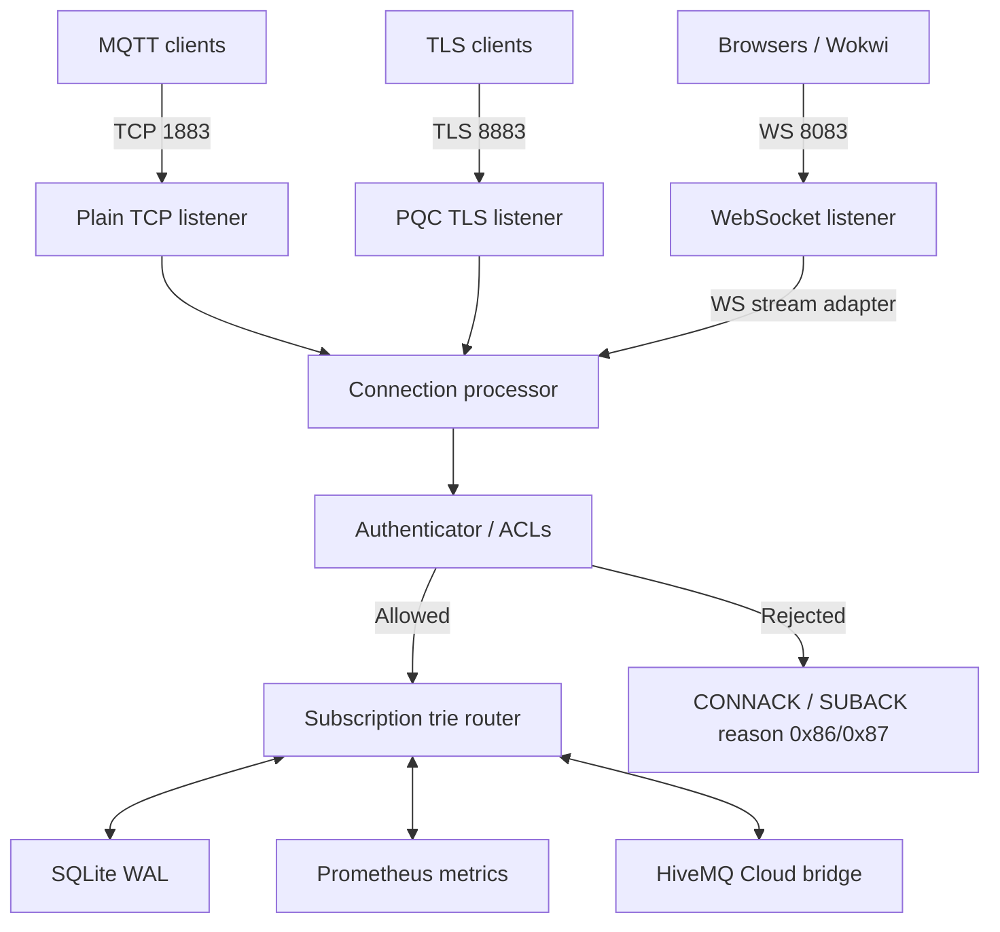

#  Pipistrelle MQTT v5.0 Broker

[](https://github.com/DaosPath/Pipistrelle/actions/workflows/ci.yml)
[](https://github.com/DaosPath/Pipistrelle/actions/workflows/security.yml)
[](https://github.com/DaosPath/Pipistrelle/releases)
[](LICENSE)
[](rust-toolchain.toml)

**Stable release:** v2.1.2.3 · **Active branch:** v2 · **Rust:** 1.98.0

Welcome to **Pipistrelle**, a lightweight, high-performance MQTT v5.0 broker written in **Rust**. It is designed for embedded systems, single-board computers such as Raspberry Pi and Orange Pi, and modern production environments.

Pipistrelle provides **post-quantum cryptography (PQC)** for TLS 1.3, crash-tolerant **SQLite WAL** persistence, native **WebSocket** support, **Prometheus** metrics and a bidirectional bridge to cloud brokers such as HiveMQ Cloud.

> [!NOTE]
> Pipistrelle implements a broad portion of MQTT 5, but it **does not currently claim 100% conformance**. The explicit support matrix and remaining work are documented in docs/MQTT5_COMPLIANCE.md.

### v2.1.2.3 status

| Gate / capability | Status |
| :--- | :--- |
| Rust unit/integration tests | **52/52** on the exact release source |
| MQTT v5 raw protocol suite | **25/25** |
| SIGKILL/restart persistence suite | **10/10** |
| TCP/Auth/ACL/TLS/WebSocket/Prometheus integration | **6/6** |
| Topic Alias QoS0 end-to-end | **~38–39 M msg/s** in controlled tuning; best short run **38.981 M/s** |
| Topic Alias ingest ceiling (separate category) | up to **216.437 M/s** median in the optimized 3×10B 2.1.2.1 gate |
| CI / security | GitHub Actions, Clippy, **clean RustSec audit**, CodeQL and Dependabot |

Ingest and end-to-end figures represent different datapaths and are reported separately; they are not used to hide QoS1/QoS2 or correctness regressions.

---

### 1T endurance validation on Orange Pi

Version 2.1.2.3 closed the round with two independent runs of **1,000,000,000,000 MQTT v5 QoS 0 end-to-end messages**. Each run used 16 clients, 62,500,000,000 messages per client, 128-byte payloads, TCP loopback, Topic Alias and the native Rust/Tokio generator. The Prometheus counter was compared before and after each run to confirm exactly 1T published messages.

| Window | Duration | Throughput | Payload | Result |
| :--- | ---: | ---: | ---: | :--- |
| 1280 | 7 h 29 min 52 s | **37.048 M msg/s** | **4.522 MiB/s** | **Exact 1T · 0 failures · 55 °C max** |
| 1024 | 7 h 58 min 52 s | **34.805 M msg/s** | **4.249 MiB/s** | **Exact 1T · 0 failures · 57 °C max** |

Both runs finished with status=ok, bench_exit=0 and exact Prometheus deltas of 1,000,000,000,000. Peak RSS was **191.9 MiB** in the first window and **172.8 MiB** in the second. This is a long-duration endurance and correctness test, not a production capacity, latency or SLA promise. Full methodology is in docs/BENCHMARKS.md; local artifacts are stored under bench-results/ and are not versioned.

---

##  Key Features

* **Zero-copy, concurrent architecture:** the packet decoder in src/codec.rs slices directly from network buffers using Rust lifetimes, minimizing allocations under high client concurrency.
* **Post-quantum TLS 1.3:** integrated with tokio-rustls and the aws-lc-rs crypto provider, preferring hybrid X25519MLKEM768 to protect IoT traffic against future decryption threats.
* **Native WebSocket support (port 8083):** MQTT over WebSockets through an AsyncRead + AsyncWrite adapter, suitable for browser dashboards and Wokwi-based simulators.
* **MQTT persistence with SQLite WAL:** persistent sessions, subscriptions, retained messages and in-flight QoS 1/QoS 2 state survive broker restarts.
* **Prometheus metrics exporter (port 9090):** an HTTP /metrics endpoint for active connections, published messages, subscriptions and broker performance.
* **Bidirectional bridge:** forwards local topics such as sensor/# to a remote broker and receives remote topics such as alerts/#.
* **Secure authentication and ACLs:** credentials.json, Argon2id password hashes, granular ACLs and a fail-closed default policy.
* **MQTT QoS 2 end-to-end:** PUBLISH → PUBREC → PUBREL → PUBCOMP, inbound deduplication, outbound state and persistent recovery.
* **MQTT v5 retained messages:** store/replace/delete, Retain Handling 0/1/2 and Retain As Published replay.
* **Last Will and Testament:** Will QoS/retain, Will Delay, clean disconnect suppression and cancellation when the same Session resumes.
* **Persistent Sessions and ClientID takeover:** Session Present, offline QoS delivery, Session Expiry and MQTT v5 takeover with DISCONNECT 0x8E; persistent sessions are bound to the authenticated principal.
* **End-to-end application properties and bidirectional Topic Alias:** preserves Payload Format Indicator, Message Expiry Interval, Content Type, Response Topic, Correlation Data and ordered/duplicate User Properties across live routing, retained/offline QoS and restart recovery.
* **Crash-persistent Wills:** complete Will state is persisted before CONNACK and restored after a full process crash while respecting deadlines and cancellation rules.
* **Automatic certificates:** if cert.pem and key.pem are missing, self-signed certificates are generated for localhost, 127.0.0.1, 10.0.1.2 and host.wokwi.internal.
* **Continuous CI and dependency security:** formatting, Clippy, release tests, isolated MQTT suites, RustSec, CodeQL and Dependabot.

---

##  System Architecture

The broker is organized into modular components for readability and scalability:


```mermaid
graph TD
    A[MQTT clients] -->|TCP 1883| B[Plain TCP listener]
    C[TLS clients] -->|TLS 8883| D[PQC TLS listener]
    E[Browsers / Wokwi] -->|WS 8083| F[WebSocket listener]

    B --> G[Connection processor]
    D --> G
    F -->|WS stream adapter| G

    G --> H[Authenticator / ACLs]
    H -->|Allowed| I[Subscription trie router]
    H -->|Rejected| J[CONNACK / SUBACK reason 0x86/0x87]

    I <--> K[SQLite WAL]
    I <--> L[Prometheus metrics]
    I <--> M[HiveMQ Cloud bridge]
```

---

##  Docker Compose Deployment

Pipistrelle is distributed as an optimized multi-stage Docker image with SQLite C-library compatibility.

### Prerequisites

* **Docker** (Docker Desktop on Windows/macOS or Docker Engine with the Compose plugin on Linux).
* **Rust 1.98.0** from rust-toolchain.toml when compiling outside Docker.

### Quick start

1. Clone the repository:
   ```bash
   git clone https://github.com/DaosPath/Pipistrelle.git
   cd Pipistrelle
   ```
2. Create local configuration files (these files are not versioned):
   ```bash
   mkdir -p config
   cp credentials.json.example config/credentials.json
   cp .env.example .env
   ```
3. Start the broker:
   ```bash
   docker compose up -d --build
   ```
4. Follow startup logs:
   ```bash
   docker compose logs -f
   ```

The container exposes:

* 1883 — plain MQTT over TCP
* 8883 — secure MQTT with PQC TLS 1.3
* 8083 — MQTT over WebSockets
* 9095 — Prometheus exporter on the host (9090 inside the container)

---

##  Environment Variables and Configuration

Configure the broker through docker-compose.yml or .env:

| Variable | Description | Default |
| :--- | :--- | :--- |
| PIPISTRELLE_PORT_TCP | Plain MQTT listener port. | 1883 |
| PIPISTRELLE_PORT_TLS | Secure MQTT listener port. | 8883 |
| PIPISTRELLE_PORT_WS | WebSocket listener port. | 8083 |
| PIPISTRELLE_PORT_METRICS | Internal metrics port. | 9090 |
| PIPISTRELLE_DB_PATH | SQLite persistence path. | /app/data/pipistrelle.db |
| PIPISTRELLE_CREDENTIALS_PATH | User and ACL file path. | /app/config/credentials.json |
| PIPISTRELLE_ALLOW_ANONYMOUS | Explicitly enables anonymous access only when true. | false |
| PIPISTRELLE_RECEIVE_MAXIMUM | Maximum simultaneous QoS1/2 Client→Server PUBLISH packets announced in CONNACK. | 1024 |
| PIPISTRELLE_MAX_PACKET_SIZE | Maximum accepted MQTT packet size. | 16777216 |
| PIPISTRELLE_TOPIC_ALIAS_MAXIMUM | Maximum inbound Topic Alias value; 0 disables inbound aliases. | 32 |
| PIPISTRELLE_CLIENT_QUEUE_CAPACITY | Logical bounded outbound queue capacity per client. | 1024 |
| PIPISTRELLE_MAX_SUBSCRIPTIONS_PER_CLIENT | Maximum subscriptions per client. | 256 |
| PIPISTRELLE_SLOW_CONSUMER_POLICY | Slow-consumer policy: backpressure or disconnect. | backpressure |
| PIPISTRELLE_WRITER_BATCH_PACKETS | Maximum packets per outbound write batch. | 256 |
| PIPISTRELLE_WRITER_BATCH_BYTES | Maximum bytes per outbound write batch. | 262144 |
| PIPISTRELLE_LATENCY_SAMPLE_RATE | Sampling rate for routing-latency metrics. | 64 |
| PIPISTRELLE_TLS_PROFILE | TLS profile: hybrid, pqc-strict or classical. | hybrid |
| PIPISTRELLE_BRIDGE_HOST | Remote HiveMQ Cloud host. | Disabled by default |
| PIPISTRELLE_BRIDGE_USER | Bridge authentication user. | None |
| PIPISTRELLE_BRIDGE_PASS | Bridge authentication password. | None |
| PIPISTRELLE_BRIDGE_PORT | Remote broker TLS port. | 8883 |

---

##  User and ACL Management

Users and permissions are configured in /config/credentials.json:

```json
{
  "users": [
    {
      "username": "admin",
      "password_hash": "$argon2id$v=19$m=19456,t=2,p=1$MjY4NGRlMWY5YzliZDUwNjBhOGJhYTJhZDM1OWViZTE$qjlHo3ALKgMXLw1bgRz/p7LGhqvC4RKrgxMuvgPNNfg",
      "acl": [
        {
          "topic": "#",
          "access": "readwrite"
        }
      ]
    },
    {
      "username": "sensor",
      "password_hash": "$argon2id$v=19$m=19456,t=2,p=1$OGI1ZWM3ZGY3MzE3YzFkNjJjYTQ2ZmQxZDQxNjFjZTM$ynDjPcANEe30mfdJLrzZKdWtclkC+v/SUcti/SYN/S0",
      "acl": [
        {
          "topic": "sensor/+",
          "access": "write"
        },
        {
          "topic": "alerts/#",
          "access": "read"
        }
      ]
    }
  ]
}
```

> [!IMPORTANT]
> password_hash uses the Argon2id PHC format; the example hashes use 19 MiB, 2 iterations and parallelism 1. The example passwords admin123 and sensor123 are for tests only and must be changed before exposing the broker. If credentials.json is missing or invalid, Pipistrelle rejects all connections by default. Anonymous access is enabled only with PIPISTRELLE_ALLOW_ANONYMOUS=true.

Generate an Argon2id hash on Linux without placing the password in shell history:

```bash
read -s PIPISTRELLE_PASSWORD
printf '%s' "$PIPISTRELLE_PASSWORD" | argon2 "$(openssl rand -hex 16)" -id -t 2 -k 19456 -p 1 -e
unset PIPISTRELLE_PASSWORD
```

> [!WARNING]
> Never store real bridge credentials in docker-compose.yml or commit them to Git. Use .env; the repository ignores .env and versions only .env.example.

---

## Native V2 Benchmark

V2 includes pipistrelle-bench, a native ARM64/Rust load generator that speaks MQTT v5 directly through Tokio instead of Python/Paho. It separates the ingest ceiling from end-to-end routing and allows TCP, classical TLS and hybrid post-quantum TLS comparisons.

```bash
cargo build --release --bin pipistrelle-bench
./target/release/pipistrelle-bench --mode ingest --clients 50 --messages 100000 --qos 0
./target/release/pipistrelle-bench --tls --tls-profile hybrid --ca config/cert.pem --mode loopback --clients 10 --messages 20000
```

The ARM64 methodology and reference results are documented in docs/BENCHMARKS.md.

Since 2.0.0.1, per-client outbound queues are **bounded**. PIPISTRELLE_CLIENT_QUEUE_CAPACITY limits pending packets; when a consumer cannot drain quickly enough, Pipistrelle applies backpressure instead of allowing unbounded memory growth. Prometheus exposes queue depth, capacity, pressure events and accumulated wait time.

Since 2.0.0.2, configurable quotas and isolation include PIPISTRELLE_MAX_SUBSCRIPTIONS_PER_CLIENT, slow-consumer policy (backpressure|disconnect), bounded bridge queues (drop-newest|backpressure) and sampled p50/p95/p99 routing-latency telemetry. /info publishes effective configuration and /metrics exposes the associated counters.

Since 2.0.0.3, the no-subscriber/no-bridge QoS 0 hot path exceeds **20 M PUBLISH/s** on the Orange Pi. A sustained 200-million-message validation reached **21.463 M msg/s**, with an exact Prometheus counter and 0 failures. This is pure ingest; end-to-end routing is measured separately.

Since 2.0.0.4, full QoS 0 end-to-end routing also exceeds 2 M/s: a sustained 50-million-message run reached **2.393 M msg/s**, exact Prometheus accounting, 0 failures and approximately 103–105 MiB of broker RAM. The optimization uses copy-on-write caching for exact topics, a direct QoS0 encoder and batched writes without removing bounded queues or backpressure.

Since 2.1.0.0, V2 includes **QoS 2**, **retained messages**, **Last Will and Testament**, persistent Session Expiry, offline QoS state and ClientID takeover with DISCONNECT 0x8E. The test_protocol_v2.py suite verifies MQTT v5 directly over sockets without relying on Paho abstractions.

Since 2.1.1.0, Pipistrelle preserves application properties through routing and persistence, applies Message Expiry using real broker wait time and persists the Will in SQLite for crash recovery. The destructive test_protocol_restart_v2.py suite uses SIGKILL to validate real recovery rather than a clean shutdown.

Since 2.1.2.0, V2 also implements **UNSUBSCRIBE/UNSUBACK**, bilateral Receive Maximum, bilateral Maximum Packet Size, server-assigned ClientIDs, fragmented CONNECT parsing over TCP and stricter MQTT UTF-8/varint validation. Defaults are PIPISTRELLE_RECEIVE_MAXIMUM=1024 and PIPISTRELLE_MAX_PACKET_SIZE=16777216.

2.1.2.1 adds Client→Server Topic Alias, isolated ARM64 fast paths, an optional Linux pipistrelle-bench --sendfile backend and a sustained 10-billion-message ingest gate. With normal host networking, three fresh brokers reached **163.550 / 160.064 / 164.866 M msg/s**; the median was **163.550 M msg/s** with 0 failures and exact Prometheus accounting. Under explicitly optimized ceiling conditions, three 10B runs reached **220.274 / 216.351 / 216.437 M msg/s**, median **216.437 M msg/s**. The ceiling result is reported separately from normal deployment behavior. Full-topic ingest and end-to-end routing are separate categories; the current source measured **57.987 M/s** full-topic ingest and **33.203 M/s** full-topic end-to-end with writer batch 1024.

2.1.2.2 adds bidirectional end-to-end Topic Alias routing. Across three sustained ~2B-message runs, Topic Alias E2E reached **35.184 / 34.543 / 35.587 M msg/s**, median **35.184 M msg/s**, 0 failures and exact Prometheus counters. A separate 500M full-topic E2E run reached **33.415 M msg/s**; a 500M Topic Alias ingest sendfile run reached **150.808 M msg/s**. The release passed **51/51 Rust**, **25/25 raw MQTT v5**, **10/10 SIGKILL/restart** and **6/6 integration** gates.

2.1.2.3 adds an optional runtime-detected **SVE gather4** scanner for the structural 9-byte Topic Alias QoS0 layout on Linux/AArch64. Any mismatch falls back to the scalar scanner so the exact first changed frame is located before general MQTT parsing. The native QoS0 benchmark also removes an unnecessary Tokio mutex from its single writer while retaining full receive-side validation. Controlled Orange Pi tuning reached **~38–39 M msg/s**, with a best validated short run of **38.981 M msg/s**. No sustained 40 M/s claim is made.

The release also adds reproducible CI, RustSec/CodeQL checks, Dependabot coverage, a pinned Rust 1.98.0 toolchain and the long-duration 1T end-to-end validation documented above.

---

##  Integration Tests

Pipistrelle includes Python integration suites covering the exposed transports and MQTT v5 behavior.

### Running the tests

1. Install the official MQTT client library:
   ```bash
   pip install paho-mqtt
   ```
2. Run the test suites from the repository root:
   ```bash
   python test_broker.py
   python test_protocol_v2.py
   # Only for the local development Docker instance; this SIGKILLs the broker.
   python test_protocol_restart_v2.py
   ```

test_broker.py contains the six transport/authentication checks. test_protocol_v2.py speaks MQTT v5 directly over sockets and validates QoS 2, retained messages, PUBLISH/Will properties, Message Expiry, subscription options, persistent sessions and takeover. test_protocol_restart_v2.py is destructive and validates persistence across a container SIGKILL/restart.

Before a release, run the Rust gates:

```bash
cargo fmt --all -- --check
cargo clippy --all-targets --all-features
cargo test --release
```

The .github/workflows/ci.yml workflow reproduces these checks in GitHub Actions and starts an isolated Docker broker for the Python suites. Tags v* additionally verify that the tag version matches VERSION.

The six base scenarios are:

* **Test 1 (TCP):** administrator connection, publish, subscribe and loopback.
* **Test 2 (Auth failure):** rejection of incorrect passwords with reason code 0x86.
* **Test 3 (ACLs):** read/write restriction checks with reason code 0x87.
* **Test 4 (TLS PQC):** secure channel and hybrid post-quantum encryption.
* **Test 5 (WebSockets):** publish and loopback over WebSockets.
* **Test 6 (Metrics):** Prometheus endpoint scrape on port 9095.

---

## CI, Security and Maintenance

Pipistrelle maintains two primary GitHub Actions pipelines:

- **CI:** cargo fmt, Clippy, release Rust tests, Docker integration, six transport/auth/ACL/TLS/WebSocket/Prometheus checks, 25 raw MQTT v5 scenarios and 10 destructive persistence/restart scenarios.
- **Security:** RustSec auditing of Cargo.lock, CodeQL analysis for Rust and weekly execution.

Dependabot checks Cargo and GitHub Actions dependencies weekly and Docker images monthly. See SECURITY.md for private vulnerability reporting and CHANGELOG.md for release history.

---

##  Wokwi Simulation (ESP32)

For a Wokwi ESP32 MQTT project using the Arduino PubSubClient library:

1. Point the broker at the Wokwi host:
   ```cpp
   const char* mqtt_server = "10.0.1.2"; // Default host IP in the Wokwi gateway
   const int mqtt_port = 1883;
   const char* mqtt_user = "sensor";
   const char* mqtt_pass = "sensor123";
   ```
2. Start the ESP32 simulation. Messages published to sensor/temp go through the local broker; if PIPISTRELLE_BRIDGE_HOST is configured in .env, the MQTT bridge forwards them to the remote broker.

---

##  License

Pipistrelle is distributed under the **MIT License**. See LICENSE for details.

Built with Rust and secure web technologies by the DaosPath team.
